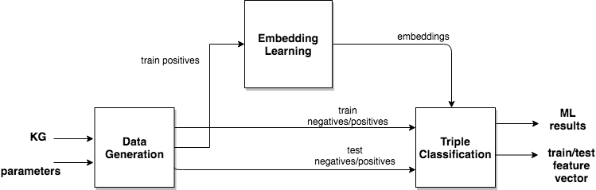

## FaVLib

In order to use an integrated solution to the fact validation problem, we developed a Fact Validation Library, called FaVLib, with a workflow implementation that uses Docker and Common Workflow Language. This library trains a classifier on embedding features to predict truthfulness of a given fact based on other facts already present in the knowledge graph.

The FaVLib uses Docker and Common Workflow Language (CWL) representation to properly configure software components and easily execute the workflow. The workflow depicted in Figure has three main steps: 
* 1- data generation 
* 2- embedding learning  
* 3- triple classification



In the first step, the data generation is carried out on a Knowledge Graph (KG) and the parameters (e.g., negative sampling strategy and test fraction ratio) to generate the necessary data sets for embedding learning and machine learning steps. Next, in the embedding learning step, training positives are used to learn entity embeddings based on the configured embedding method and embedding parameters. In the final step, basic classifiers are trained on the training data and evaluated on test data using embedding features, and feature vectors are exported to be re-usable for other machine learning algorithms / platforms. 

The library integrates various tools including AYNEC (https://github.com/tdg-seville/AYNEC), which generates negative/positive samples and splits data into train and test set, and PyKEEN (https://github.com/SmartDataAnalytics/PyKEEN), which learns multiple embedding methods and machine learning methods for triple fact classification. 

## How to run

## Using Docker 
* First make sure Docker is installed!!

* Clone the current repository
```shell
git clone https://github.com/MaastrichtU-IDS/FaVLib.git
```
* Enter the repository
```shell
cd FavLib
```

```shell
docker build -t favlib .
```

```shell
docker run -d  --rm --name favlib -p 8888:8888 -v $(pwd):/jupyter -v /tmp:/tmp favlib
```
```shell
docker exec -it favlib cwltool --outdir=/jupyter/output/ workflow/main-workflow-pykeen.cwl workflow/workflow-pykeen.yml
```

* That's it!!
